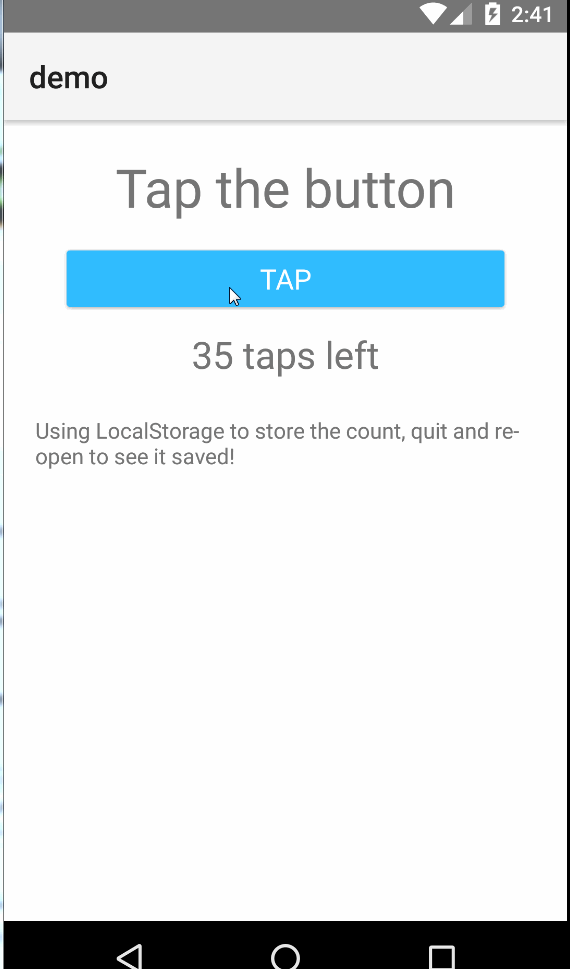

[](https://www.npmjs.com/package/nativescript-localstorage)
[](https://www.npmjs.com/package/nativescript-localstorage)
[](https://www.npmjs.com/package/nativescript-localstorage)

# nativescript-localstorage
A NativeScript plugin to add LocalStorage
If you are trying to use any libraries that use the localStorage API; or you want a fairly simple storage engine; here it is.

## License

This is released under the MIT License, meaning you are free to include this in any type of program -- However for entities that need a support contract, changes, enhancements and/or a commercial license please contact me at [http://nativescript.tools](http://nativescript.tools).

I also do contract work; so if you have a module you want built for NativeScript (or any other software projects) feel free to contact me [nathan@master-technology.com](mailto://nathan@master-technology.com).

[](https://www.paypal.com/cgi-bin/webscr?cmd=_donations&business=HN8DDMWVGBNQL&lc=US&item_name=Nathanael%20Anderson&item_number=nativescript%2dlocalstorage&no_note=1&no_shipping=1&currency_code=USD&bn=PP%2dDonationsBF%3ax%3aNonHosted)
[](https://www.patreon.com/NathanaelA)

## Sample Snapshot

 

## Installation 

tns plugin add nativescript-localstorage  


## Usage

To use the module you just `require()` it:

```js
require( "nativescript-localstorage" );

localStorage.setItem('Another Plugin', 'By Master Technology');
```

This will enable the localStorage api.   So then you can use it just like a browser.  

You can also optionally do:
```js
let LS = require( "nativescript-localstorage" );
LS.getItem('Another Plugin');  // Returns: "By Master Technology"
```

## You ask, how exactly does this help?
This allows you to use LocalStorage as if it is built into NativeScript.


### API

#### localStorage.getItem(name) - Get a value from Storage
##### name - the key to get
This will return whatever you stored in that key, or null if that key doesn't exist.

```js
let me = localStorage.getItem('MeaningOfLife') || 42;
```

#### localStorage.setItem(name, value) - Set a value into storage
##### name - the key to set
##### value - the value to set; this can be number, string, object, array.  (Must be a native JavaScript object)

```js
localStorage.setItem('Zork', 'You are about to be eaten by a Grue!');
```


#### localStorage.removeItem(name) - Delete and item from storage
##### name - the key to delete

```js
localStorage.removeItem('Zork');  // Guess you were eaten and removed!  :-)
```

#### localStorage.clear() - clear all storage
 
 ```js
 localStorage.clear();
 ```
 
#### localStorage.length  - Number of items stored
Returns the number of keys stored

```js
console.log("Keys stored", localStorage.length);
```

#### localstorage.key(id) - Return the key name at this position 
##### id - 0 based id of the key
##### returns: string name of the key (or null if id is past size of saved storage )


```js
console.log("Key at 0 is", localStorage.key(0));
```

